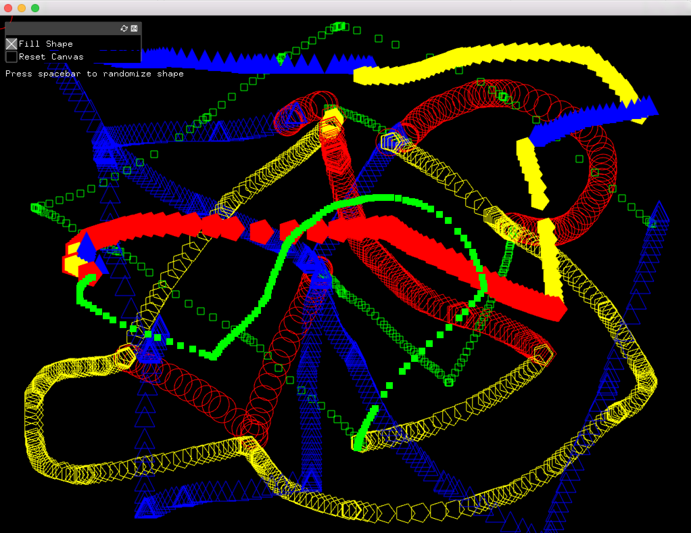
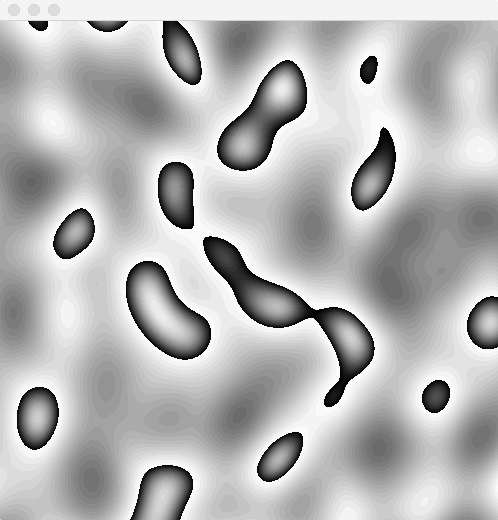
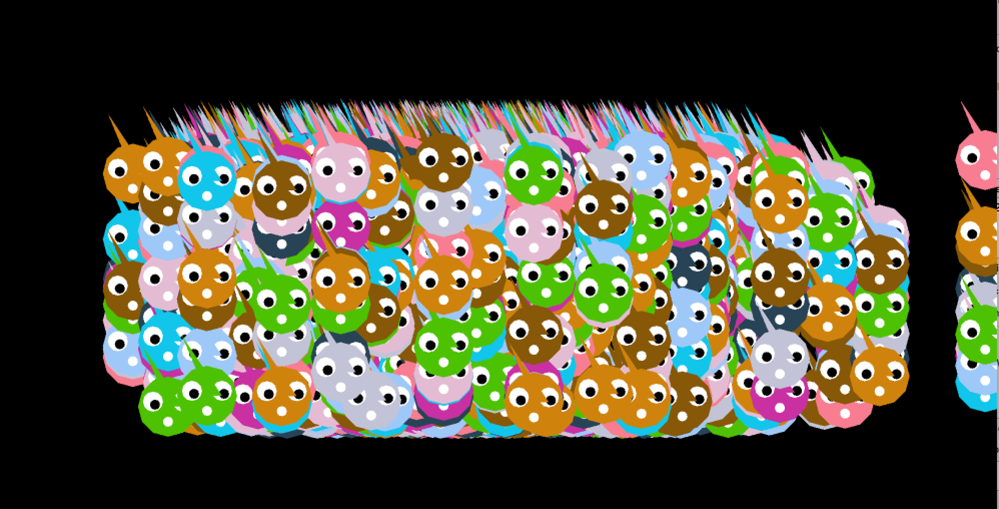

# UmiSyam_OFanimation2015

PGTE 5566 / [Animation By Code - taught by Bernardo Schorr](https://github.com/bschorr/OFAnimation_Spring2015) / Spring 2015 / Parsons The New School for Design / MFA Design & Technology
_____________________________________________
## Homework: Week 02
A - Random Drawing Tool

B - Noise Landscape

C - Gaussian Population: 1000 objects from class "Punk".

